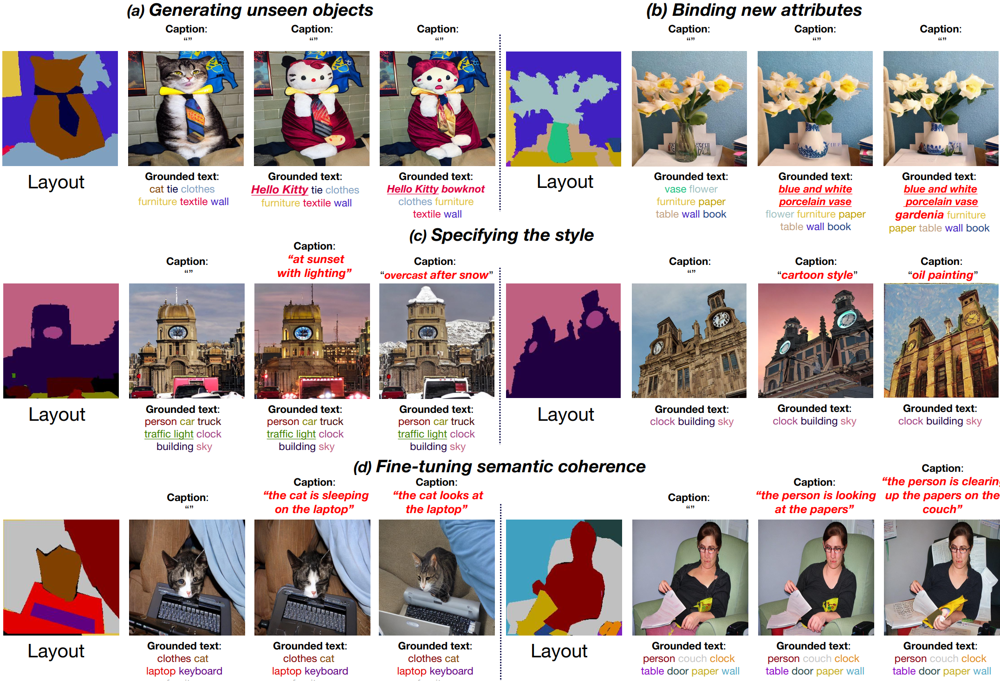

<div align="center">
<h1>Enhancing Object Coherence in Layout-to-Image Synthesis</h1>

[Yibin Wang](https://codegoat24.github.io/), Honghui Xu, Changhai Zhou, [Weizhong Zhang](https://weizhonz.github.io/)&#8224;, [Cheng Jin](https://cjinfdu.github.io/)&#8224; 

<a href="https://arxiv.org/pdf/2311.10522">
</a>
<a href="">
</a>
</div>

</div>

## 📖 Abstract

Layout-to-image synthesis is an emerging technique in conditional image generation. It aims to generate complex scenes, where users require fine control over the layout of the objects in a scene. However, it remains challenging to control the object coherence, including semantic coherence (e.g., the cat looks at the flowers or not) and physical coherence (e.g., the hand and the racket should not be misaligned). In this paper, we propose a novel diffusion model with effective global semantic fusion (GSF) and self-similarity feature enhancement modules to guide the object coherence for this task. For semantic coherence, we argue that the image caption contains rich information for defining the semantic relationship within the objects in the images. Instead of simply employing cross-attention between captions and latent images, which addresses the highly relevant layout restriction and semantic coherence requirement separately and thus leads to unsatisfying results shown in our experiments, we develop GSF to fuse the supervision from the layout restriction and semantic coherence requirement and exploit it to guide the image synthesis process. Moreover, to improve the physical coherence, we develop a Self-similarity Coherence Attention (SCA) module to explicitly integrate local contextual physical coherence relation into each pixel's generation process. Specifically, we adopt a self-similarity map to encode the physical coherence restrictions and employ it to extract coherent features from text embedding. Through visualization of our self-similarity map, we explore the essence of SCA, revealing that its effectiveness is not only in capturing reliable physical coherence patterns but also in enhancing complex texture generation. Extensive experiments demonstrate the superiority of our proposed method in both image generation quality and controllability. Both qualitative and quantitative results demonstrate the superiority of our method to the state of the art.



## 🗓️ TODOs

- [x] Release inference code
- [x] Release pre-trained models
- [x] Release demo
- [ ] Release training code and data
- [ ] Release evaluation code and data

## 🚀 Demo

### Setup

Please clone the repository and set up the environment:
```
cd EOCNet
conda env create -f environment.yaml
conda activate eoc
```

You will also need to download the pre-trained Stable Diffusion model (or manually download it from [here](https://huggingface.co/stabilityai/stable-diffusion-2-1-base)):

```
mkdir models/ldm/stable-diffusion
wget -O models/ldm/stable-diffusion/sd-v2-1-full-ema.ckpt https://huggingface.co/stabilityai/stable-diffusion-2-1-base/blob/main/v2-1_512-ema-pruned.ckpt
```


### Pre-trained Models

We provide two models trained on COCO-Stuff and ADE20K respectively.

* [eoc-sd-v1-4-coco.ckpt](https://drive.google.com/file/d/1GqAMPM-aqIo7L5cL5MOubZ_5FVKW4NEK/view?usp=sharing)
* [eoc-sd-v1-4-ade20k.ckpt](https://drive.google.com/file/d/1CXsjwVOIEcNqKkI407UNyJfvVwrOsE04/view?usp=share_link)

### Data Preparation

You need to prepare a layout image and a json file that defines the mapping between text and layout.

```
{
  "text_label_mapping": {
    "cat": 16,
    "bowknot": 31,
    "clothes": 104,
    "furniture-other": 122,
    "textile-other": 166,
    "wall-brick": 171
  },
  "caption": "",
  "layout_path": "./cat.png"
}
```

* Binding new attributes/generating unseen objects: Just describe the object with the desired attribute or describe a new object, e.g., change <"cat": 84> to <"Hello Kitty": 84>.
* Specifying the style/fine-tuning semantic coherence: Just description the desired image style/specific semantic coherence in <"caption": "...">. 

### Run

We provide several examples in `examples/` and you try them out by running:

```
python demo.py --config configs/stable-diffusion/v1-inference_demo.yaml \
            --ckpt path_to_ckpt \
            --json examples/cat.json \
            --outdir outputs/demo \
            --seed 24 \
            --plms 
```

A reference script `demo.sh` is provided as well.

## 🙏 Acknowledgments

We thanks to [Stable Diffusion](https://github.com/CompVis/stable-diffusion) and [Textual Inversion](https://github.com/rinongal/textual_inversion) and [FreestyleNet](https://github.com/essunny310/FreestyleNet).

## 🖊️ BibTeX

If you find this project useful in your research, please consider cite:

```bibtex
@article{EOCNet,
  title={Enhancing Object Coherence in Layout-to-Image Synthesis},
  author={Wang, Yibin and Zhang, Weizhong and Zheng, Jianwei and Jin, Cheng},
  journal={arXiv preprint arXiv:2311.10522},
  year={2023}
}```
```
