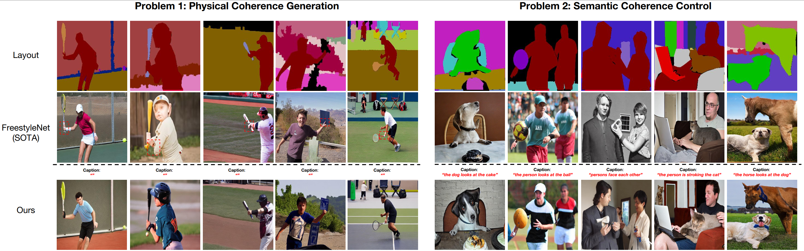

# Enhancing Object Coherence in Layout-to-Image Synthesis

Official implementation of [Enhancing Object Coherence in Layout-to-Image Synthesis](https://arxiv.org/pdf/2311.10522.pdf).

> **Enhancing Object Coherence in Layout-to-Image Synthesis**<br>
> Yibin Wang, Weizhong Zhang, Jianwei Zheng, and Cheng Jin <br>
> 
## Abstract
Layout-to-image synthesis is an emerging technique in conditional image generation. It aims to generate complex scenes, where users require fine control over the layout of the objects in a scene. However, it remains challenging to control the object coherence, including semantic coherence (e.g., the cat looks at the flowers or not) and physical coherence (e.g., the hand and the racket should not be misaligned). In this paper, we propose a novel diffusion model with effective global semantic fusion (GSF) and self-similarity feature enhancement modules to guide the object coherence for this task. For semantic coherence, we argue that the image caption contains rich information for defining the semantic relationship within the objects in the images. Instead of simply employing cross-attention between captions and generated images, which addresses the highly relevant layout restriction and semantic coherence separately and thus leads to unsatisfying results shown in our experiments, we develop GSF to fuse the supervision from the layout restriction and semantic coherence requirement and exploit it to guide the image synthesis process. Moreover, to improve the physical coherence, we develop a Self-similarity Coherence Attention (SCA) module to explicitly integrate local contextual physical coherence into each pixel's generation process. Specifically, we adopt a self-similarity map to encode the coherence restrictions and employ it to extract coherent features from text embedding. Through visualization of our self-similarity map, we explore the essence of SCA, revealing that its effectiveness is not only in capturing reliable physical coherence patterns but also in enhancing complex texture generation. Extensive experiments demonstrate the superiority of our proposed method in both image generation quality and controllability. Our model outperforms the previous SOTA methods on FID and DS by relatively 0.9, 3.3\% on COCO-stuff, and 1.1 3.2\% on ADE20K.




## TODOs

- [ ] Release inference code
- [ ] Release pre-trained models
- [ ] Release demo
- [ ] Release training code and data
- [ ] Release evaluation code and data


## Citation

If you find EOCNet relevant to your research, please kindly cite our paper:

```bibtex
@article{wang2023enhancing,
  title={Enhancing Object Coherence in Layout-to-Image Synthesis},
  author={Wang, Yibin and Zhang, Weizhong and Zheng, Jianwei and Jin, Cheng},
  journal={arXiv preprint arXiv:2311.10522},
  year={2023}
}
```